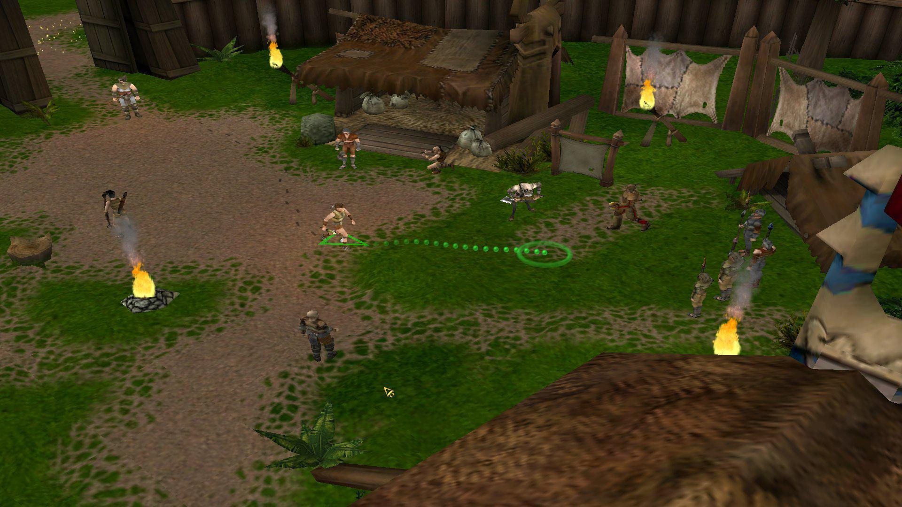

# allods3-modding

Сборник ссылок на гайды и материалы по созданию модов для **Аллоды 3: Проклятые Земли**.

> Цель репозитория — держать всё полезное в одном месте и не терять ссылки со временем.

## Основные ресурсы

- **Главная подборка материалов по моддингу Аллодов 3:**  
<a href="https://allods.gipat.ru/index.php?p=eimodz" target="_blank" rel="noopener noreferrer">
https://allods.gipat.ru/index.php?p=eimodz
</a>

## Гайды и инструкции

- **Работа с Mod Creator (текстовый гайд):**  
<a href="https://allods.gipat.ru/index.php?p=eimodzworkwithmodcreator" target="_blank" rel="noopener noreferrer">
https://allods.gipat.ru/index.php?p=eimodzworkwithmodcreator
</a>

## Видео

- YouTube:  
<a href="https://www.youtube.com/watch?v=rc66M9TQJpM&t=6s" target="_blank" rel="noopener noreferrer">
https://www.youtube.com/watch?v=rc66M9TQJpM&t=6s
</a>

- YouTube:  
<a href="https://www.youtube.com/watch?v=CCzHDl37Gpo" target="_blank" rel="noopener noreferrer">
https://www.youtube.com/watch?v=CCzHDl37Gpo
</a>

## Как добавить ссылку

1) Открой Pull Request или создай Issue  
2) Укажи:
- ссылку  
- короткое описание (1–2 строки)  
- тип материала: гайд / видео / инструмент / архив / пример мода  

## Лицензия

README и структура репозитория — свободные.  
Контент по ссылкам принадлежит их авторам.
